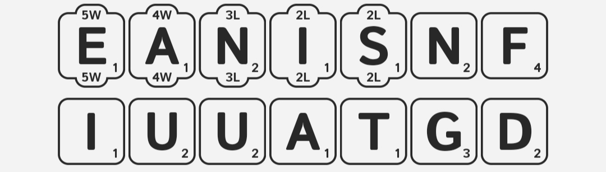
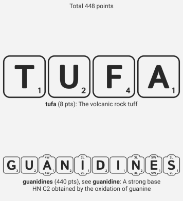

# wordup

This is a Python script to find optimum solutions for the mobile game [Wordiest](https://play.google.com/store/apps/details?id=com.concreterose.wordiest&hl=en_US).

## Example

Given letters:



Pass the input to the script like so:

```
$ python3 wordup.py -w 5e 4a -l 3n 2is 1nfaiuuatgd
 448 - guanidines, tufa
 446 - guanidines, aft
 446 - guanidines, fat
 445 - fastening, dui
 444 - guanidines, tau
 444 - guanidines, uta
 444 - fastening, aid
 443 - fastening, ad
 443 - fastening, da
 443 - fastening, id
 428 - nauseating, fud
 427 - nauseating, dif
 427 - nauseating, fad
 427 - nauseating, fid
 425 - destaining, fa
 425 - nauseating, dui
 422 - destaining, aa
 410 - guanidine, tufas
 409 - insinuated, fug
 408 - guanidine, tufa
```

Score:



Rank (first place):


